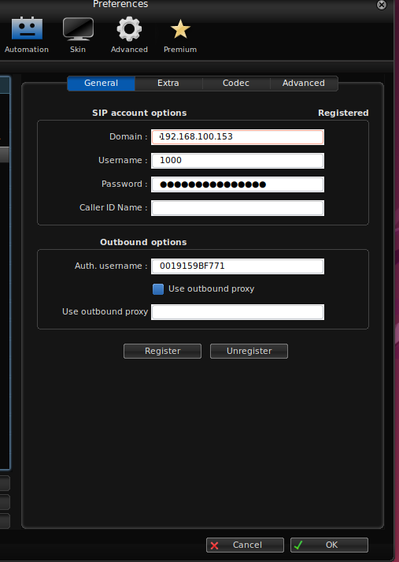

# Instalação e configuração de sons em Português no Asterisk

_**Atualização!** no mês 06/2024 notou-se que o site https://www.asterisksounds.org/ de onde os áudios eram baixados ficou indisponível! Por este motivo este passo a passo foi atualizado para baixar os áudios em português do Brasil diretamente deste repositório do github._

**1 - Criar o diretório que irá conter os áudios**

```bash
mkdir /var/lib/asterisk/sounds/pt-br
```

**2 - Baixar os pacotes de áudio:**

```bash
cd /var/lib/asterisk/sounds/pt-br

wget -O audios_pt-br_part01.zip https://raw.githubusercontent.com/beneditomarques/basic-asterisk-training/main/instalacao-do-asterisk/audios_pt-br_part01.zip

wget -O audios_pt-br_part02.zip https://raw.githubusercontent.com/beneditomarques/basic-asterisk-training/main/instalacao-do-asterisk/audios_pt-br_part02.zip

wget -O audios_pt-br_part03.zip https://raw.githubusercontent.com/beneditomarques/basic-asterisk-training/main/instalacao-do-asterisk/audios_pt-br_part03.zip
```

**3 - Instalar o 'unzip' e usá-lo para descompactar os pacotes baixados:**

```bash
apt install unzip -y
unzip -o audios_pt-br_part01.zip
unzip -o audios_pt-br_part02.zip
unzip -o audios_pt-br_part03.zip
```

**4 - Instalar o sox, criar o script de conversão de áudios de '.sln16' para '.gsm' e executá-lo:**

```bash
apt install sox -y
vim /var/lib/asterisk/sounds/pt-br/convert 
```
Conteúdo do arquivo:

```bash
#!/bin/bash
for a in $(find . -name '*.sln16'); do
  sox -t raw -e signed-integer -b 16 -c 1 -r 16k $a -t gsm -r 8k `echo $a|sed "s/.sln16/.gsm/"`;\
done
```
Executando:

```bash
bash convert 
```

Você deverá notar agora arquivos .sln16 e .gsm em seu diretório /var/lib/asterisk/sounds/pt-br:

```bash
ls /var/lib/asterisk/sounds/pt-br
```

**5 - Alterar a permissão dos diretórios para 775:**

```bash
find /var/lib/asterisk/sounds/pt-br -type d -exec chmod 0775 {} \;
```


**6 - Configurar um contexto "audio-test". Adicione estas linhas ao final do arquivo /etc/asterisk/extensions.conf:**

 
```bash
[audio-test]
exten => *65,1,Noop(Fala o numero do ramal)
 same =>     n,Answer()
 same =>     n,SayDigits(${CALLERID(num)})
 same =>     n,Hangup()
```

**7 - Configurar o ramal para ficar com o idioma escolhido (Adicione estas linhas ao final do arquivo /etc/asterisk/pjsip.conf):**


```bash
[1000]
type = endpoint
auth = 1000
aors = 1000
allow = !all,alaw,ulaw
dtmf_mode = rfc4733
callerid = Meu ramal <1000>
language = pt-br
context = audio-test

[1000]
type = auth
auth_type = userpass
password = 4webrEtHupHewu4
username = 0019159BF771


[1000]
type = aor
max_contacts = 1
```

**8 - Carregar o codec alaw e recarregar os módulos e plano de discagem:**

```bash
rasterisk -x 'module load codec_alaw.so'
rasterisk -x 'module reload res_pjsip.so'
rasterisk -x 'dialplan reload'
```

**OBS**: para que o codec alaw e outros módulos possam ser carregados automaticamente após a reinicialização do servidor, atualize o arquivo /etc/asterisk/modules.conf para que fique com apenas o conteúdo abaixo e reinicie o Asterisk.

<details open><summary>modules.conf</summary>

```
[modules]
autoload = yes
noload => chan_sip.so
```

</details>


**9 - Verifique se o ramal ficou com o idioma configurado:**

```bash
rasterisk -x 'pjsip show endpoint 1000' | grep language
```

**10 - Configurar o softphone e efetuar o teste:**



Com o softphone autenticado agora basta discar para *65 e ouvir o número do seu ramal em português!


