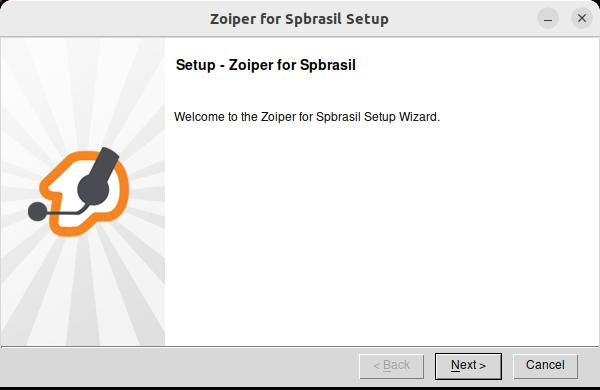
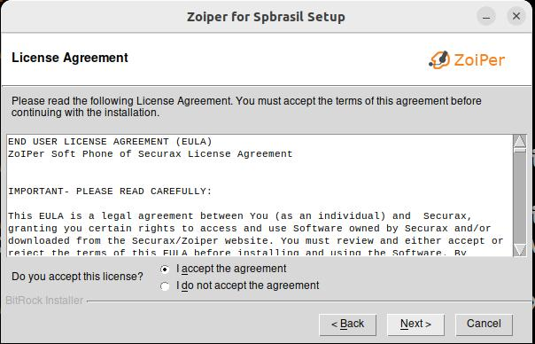
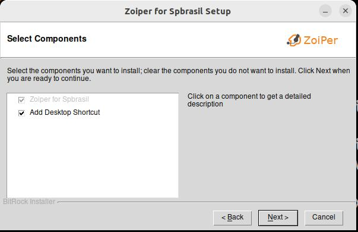
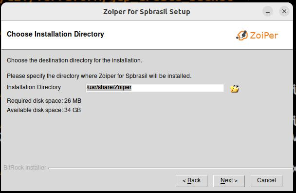
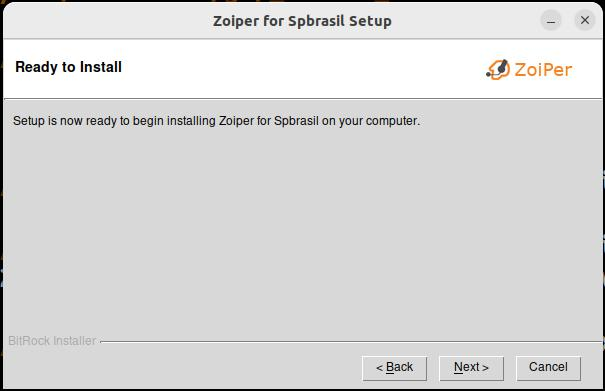
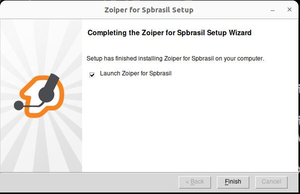
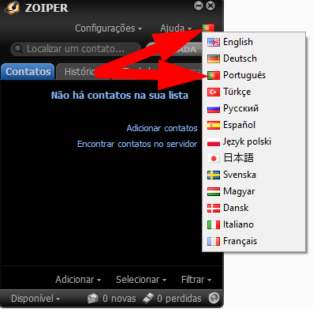

# Instalando o Zoiper no Windows

**Obs:** 

- O instalador do Zoiper utilizado neste tutorial foi obtido do site oficial https://www.zoiper.com
- Foi utilizada a versão 3 por permitir a utilização de múltiplas contas SIP, porém você pode utilizar qualquer versão durante as aulas.


**1 - Baixe o Zoiper (versão 3) para a sua pasta de Downloads:**

```bash
cd /tmp/
wget https://raw.githubusercontent.com/beneditomarques/basic-asterisk-training/b2e684f23af6a9f9794ac0314cb29f9a338d5461/instalacao-zoiper/Zoiper_for_AATeleccom_Linux_64bit_v3.20.run
```

**2 - Dê permissão de execução:**

```bash
chmod +x Zoiper_for_AATeleccom_Linux_64bit_v3.20.run
```

**3 - Execute o instalador:**

```bash
sudo ./Zoiper_for_AATeleccom_Linux_64bit_v3.20.run
```








**4 - Abra o Zoiper (procure na sua lista de apps) e altere o idioma conforme sua preferência:**



**Pronto, o Zoiper está instalado!**
