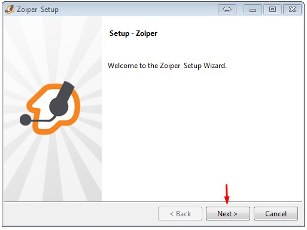
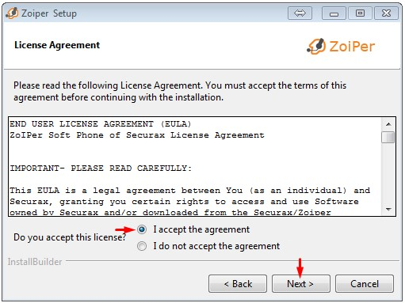
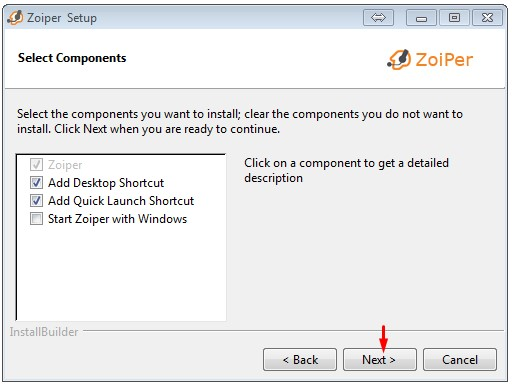
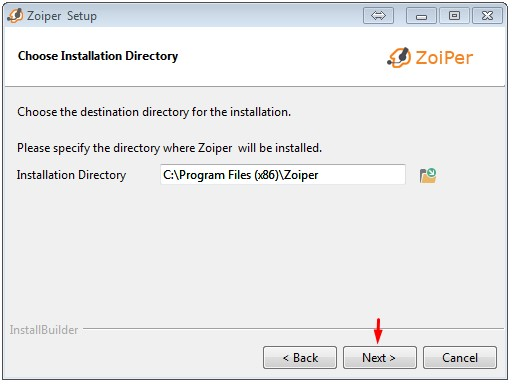
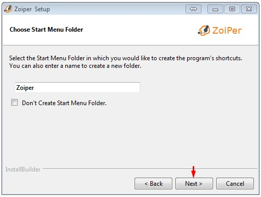
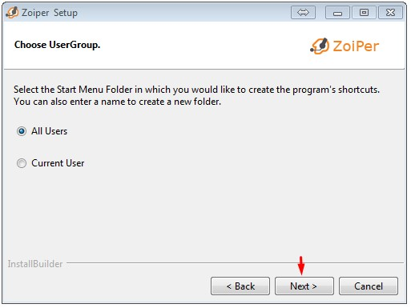
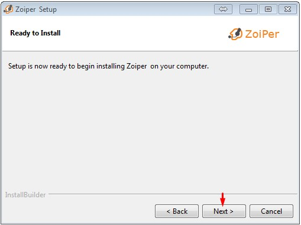
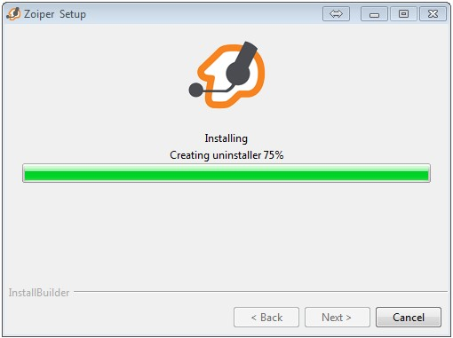
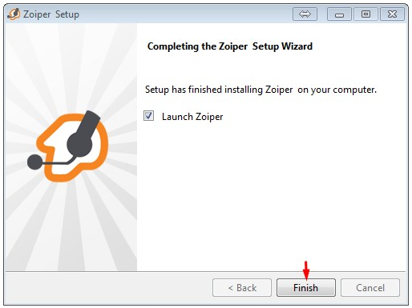

# Instalando o Zoiper no Windows

**Obs:** 

- O instalador do Zoiper utilizado neste tutorial foi obtido do site oficial https://www.zoiper.com
- Foi utilizada a versão 3 por permitir a utilização de múltiplas contas SIP, porém você pode utilizar qualquer versão durante as aulas.


**1 - Baixe o Zoiper (versão 3) e execute o arquivo:**

```
https://github.com/beneditomarques/basic-asterisk-training/blob/main/instalacao-zoiper/Instalacao-zoiper-windows.md
```











**2 - Altere o idioma conforme sua preferência:**


**Pronto, o Zoiper está instalado!**
