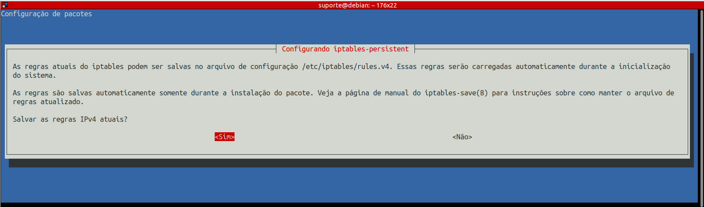
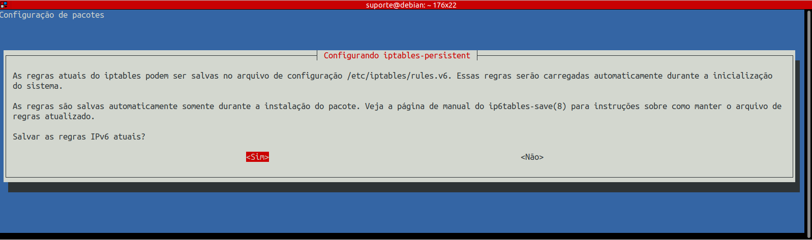

# Segurança: iptables

1 - Criar o script `/opt/regras.sh` com o conteúdo abaixo (trocar o valor da rede interna para o seu ambiente):

```bash
#!/bin/bash
# Asterisk na prática: Script para aplicar regras básicas de firewall

INTERNAL_NETWORK=192.168.100.0/24

# Politica de bloqueio geral
iptables -P INPUT DROP

# Permissoes padroes para loopback e conexoes relacionadas
iptables -A INPUT -i lo -j ACCEPT
iptables -A INPUT -m state --state ESTABLISHED -j ACCEPT
iptables -A INPUT -m state --state RELATED -j ACCEPT

# ICMP
iptables -A INPUT -p icmp -j ACCEPT

# SSH
iptables -A INPUT -p tcp -s $INTERNAL_NETWORK --dport 22 -j ACCEPT

# PHPMyAdmin
iptables -A INPUT -p tcp -s $INTERNAL_NETWORK --dport 9090 -j ACCEPT

# SIP + RTP
iptables -A INPUT -p udp -m udp -s $INTERNAL_NETWORK --dport 5060 -j ACCEPT
iptables -A INPUT -p udp -m udp -s $INTERNAL_NETWORK --dport 10000:20000 -j ACCEPT

# SIP - Simulador de operadoras
iptables -A INPUT -p udp -m udp -s $INTERNAL_NETWORK --dport 5080 -j ACCEPT

# IAX
iptables -A INPUT -p udp -m udp -s $INTERNAL_NETWORK --dport 4569 -j ACCEPT
```

2 - Dar permissão de execução ao script e executar:

```bash
chmod +x /opt/regras.sh
bash /opt/regras.sh
```

3 - Testar a conexão com o módulo http (deverá estar bloqueada):

http://192.168.100.153:8088/httpstatus

4 - Instalar o pacote `iptables-persistent` para que as regras fiquem persistentes. Indique que quer salvar as regas atuais em /etc/iptables/rules.v4:

```bash
apt install iptables-persistent -y
```



5 - Confira se o arquivo contém as regras atuais e reinicie o servidor:

```bash
reboot
```

Após o reboot as regras deverão ser as mesmas.

